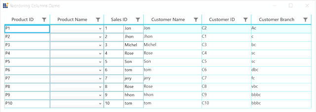

# How to Navigate to the Multiple Controls Loaded in GridTemplateColumn by Tab Key in WPF DataGrid?

This sample show cases how to navigate to the multiple controls loaded in [GridTemplateColumn](https://help.syncfusion.com/cr/wpf/Syncfusion.UI.Xaml.Grid.GridTemplateColumn.html) by Tab Key in [WPF DataGrid](https://www.syncfusion.com/wpf-controls/datagrid) (SfDataGrid).

`DataGrid` does not support navigation to controls within `GridTemplateColumn`. You can achieve this by overriding [ShouldGridTryToHandleKeyDown](https://help.syncfusion.com/cr/wpf/Syncfusion.UI.Xaml.Grid.Cells.GridCellTemplateRenderer.html#Syncfusion_UI_Xaml_Grid_Cells_GridCellTemplateRenderer_ShouldGridTryToHandleKeyDown_System_Windows_Input_KeyEventArgs_) method in [GridCellTemplateRenderer](https://help.syncfusion.com/cr/wpf/Syncfusion.UI.Xaml.Grid.Cells.GridCellTemplateRenderer.html).


```c#
public class SfDataGridBehavior : Behavior<SfDataGrid>
{
    protected override void OnAttached()
    {
        base.OnAttached();
        this.AssociatedObject.CellRenderers.Remove("Template");
        this.AssociatedObject.CellRenderers.Add("Template", new CustomGridCellTemplateRenderer());
    }
}

public class CustomGridCellTemplateRenderer : GridCellTemplateRenderer
{
    private FrameworkElement PreviousCurrentCellElement = null;

    public CustomGridCellTemplateRenderer()
    {
    }

    protected override bool ShouldGridTryToHandleKeyDown(KeyEventArgs e)
    {
        if (e.Key != Key.Tab)
            return base.ShouldGridTryToHandleKeyDown(e);

        bool isShiftPressed = SelectionHelper.CheckShiftKeyPressed();
        UIElement currentFocusedElement = Keyboard.FocusedElement as UIElement;
        var currentCell = this.DataGrid.SelectionController.CurrentCellManager.CurrentCell;
        var columnElement = currentCell.ColumnElement;
        //Column with Multiple controls inside DataTemplate.
        if (currentCell.GridColumn.MappingName != "SalesID")
            return base.ShouldGridTryToHandleKeyDown(e);

        if (PreviousCurrentCellElement != columnElement && currentFocusedElement is SfDataGrid)
        {
            FocusNavigationDirection focusNavigationDirection = isShiftPressed ? FocusNavigationDirection.Last : FocusNavigationDirection.First;
            TraversalRequest tRequest = new TraversalRequest(focusNavigationDirection);
            //To navigate from other column to template column
            if (columnElement.MoveFocus(tRequest))
            {
                e.Handled = true;
                PreviousCurrentCellElement = columnElement;
                return false;
            }
        }
        else
        {
            FocusNavigationDirection focusNavigationDirection = isShiftPressed ? FocusNavigationDirection.First : FocusNavigationDirection.Last;
            TraversalRequest traversalRequest = new TraversalRequest(focusNavigationDirection);
            if (columnElement.MoveFocus(traversalRequest))
            {
                if (Keyboard.FocusedElement != currentFocusedElement)
                {
                    Keyboard.Focus(currentFocusedElement);
                    PreviousCurrentCellElement = columnElement;
                    return false;
                }
                //To navigate to other columns from template column
                else
                {
                    Keyboard.Focus(currentFocusedElement);
                    PreviousCurrentCellElement = null;
                    return base.ShouldGridTryToHandleKeyDown(e);
                }
            }
        }

        PreviousCurrentCellElement = columnElement;
        return base.ShouldGridTryToHandleKeyDown(e);
    }
}
```

